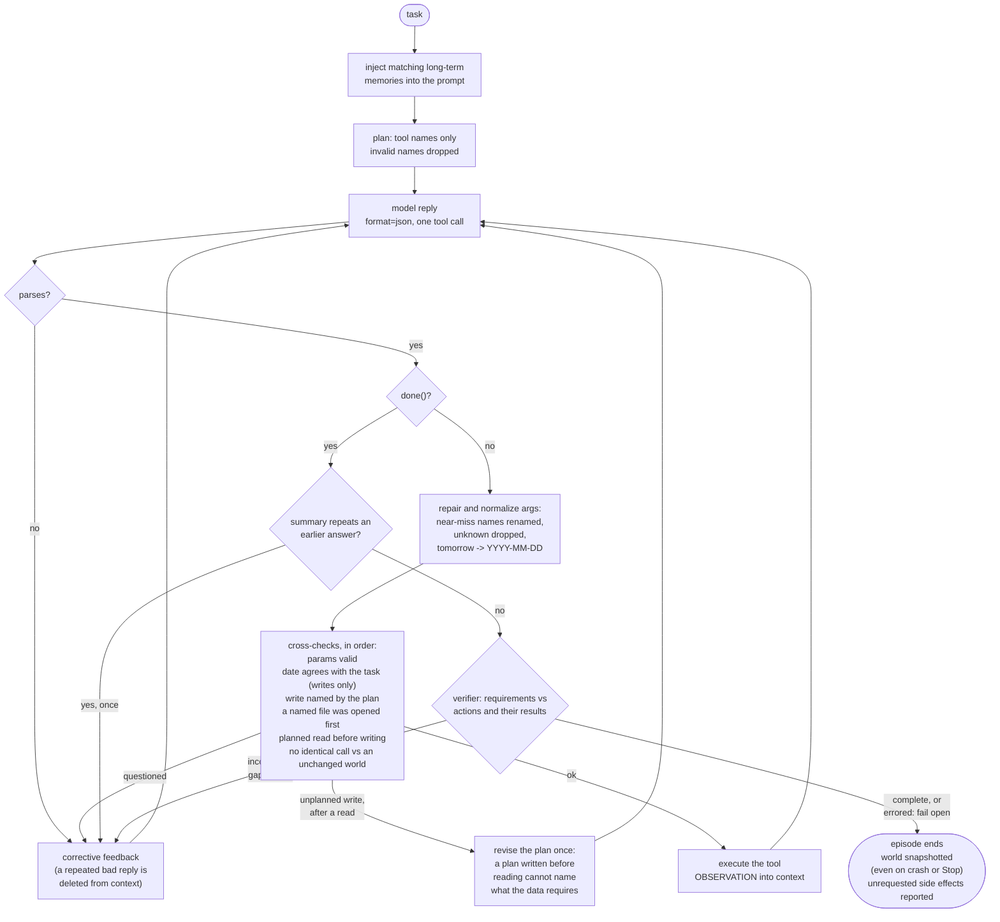

# Agent 8B

A local agent harness. An 8B model runs on this machine, drives a set of tools,
and is checked by a loop that plans before it acts and verifies before it stops.
Inference, files, memory and state stay on the device; the runner asserts its
model endpoint is loopback and refuses anything else.

The claim the project exists to test:

> The model is not the agent. The model is one component inside a loop that
> supplies the structure, the checking, and the memory.

`harness/agent.py` holds two loops over the same tools and the same call budget
— `run_raw()`, which is what you get wiring a model to tools naively, and
`run_harness()`, the same skeleton plus the scaffolding below. The experiment
varies only the scaffolding around the model. That constraint is why parts of
this codebase look over-careful.

---

## Start it

Two backends. **Both own port 11434, so never run both.**

```powershell
winget install --id ezwinports.make    # make is not installed by default

make doctor        # toolchain, hardware, and what is currently listening
make ollama-up     # CPU backend
make lab           # Agent Lab in a window
```

Or headless, and without make:

```powershell
cd agents\8b
.\run.ps1 "Find a free hour on Thursday and book it as Deep work"
```

On the Hexagon NPU instead, through Qualcomm's GenieX runtime:

```powershell
make npu-pull      # fetch the model bundle, pre-compiled for X Elite
make npu-up        # geniex serve on :18181, OpenAI API
make shim          # Ollama-API shim on :11434, so the harness is unchanged
make lab
```

The shim is the whole NPU integration: the harness only ever talks to
`OLLAMA_URL /api/chat`, so translating that to `/v1` is the entire job. No agent
code, no loop behaviour, no UI changes. See
[notes/NPU Serving.md](notes/NPU%20Serving.md).

Prerequisites are `requests`, plus `python-pptx` and `openpyxl` for the document
tools. `make pydeps` installs them. The launchers (`Agent Lab.ps1`,
`Agent Lab.command`) install them on first run and start the backend for you.

---

## What is here

| path | what |
|---|---|
| `harness/` | the loop, the tool registry, the safety layers — the only place loop behaviour is defined |
| `agents/8b/` | the agent: its config, runner, workspace, memory and run logs |
| `webui/` | Agent Lab, a loopback console that shows the loop working |
| `mcp/` | the real-account server registry, and a self-test that needs no credentials |
| `npu/` | the Ollama-API shim in front of GenieX |
| `tests/` | the harness test suite |
| `notes/` | the working vault: design reasoning, written for Obsidian |

```powershell
python -m tests.test_harness    # the harness suite; stdlib unittest, no pytest
python -m mcp.test_bridge       # the MCP safety guarantees, no credentials needed
```

---

## The loop

One tool call per model reply, JSON only.



Every box above is paid out of the same call budget as the work itself, and
every arrow into *corrective feedback* is a question, not a block: a call the
model repeats after being questioned is allowed to run.

**Plan.** One call asks for a tool-grounded plan. Steps naming a tool that does
not exist are dropped, and the plan re-enters as short numbered guidance. The
plan *request* is popped from the context, so the model never sees its own
planning prose again — free-form prose is never allowed to become an instruction
the model then obeys.

**Act.** Decode under `format=json`, parse strictly, then repair: near-miss
parameter names are renamed onto the required ones, unknown parameters dropped,
dates and times normalized against the clock. Arguments are validated *before*
execution, and the failure message quotes the tool's own worked example rather
than describing a schema — showing a small model the right shape beats telling
it. Then the cross-checks: a date the model wrote itself is compared against the
date the task names, so "Wednesday" cannot become a Monday unnoticed (on writes
only — a read with a mismatched date is the model looking around). A write the
plan never proposed is questioned once. And a document write is questioned once
when something the agent *read* names a file that exists here and it never
opened it: writing from memory while the task's own data sits on disk is the
failure this harness exists to catch.

**Replan.** The plan is written before the agent has read anything, so on a task
whose requirements live in the data ("read this email and do what it asks") it
cannot name the work. Once a read has landed, an unplanned write spends one call
revising the plan instead of being held to it. Only once: a model that could
replan on every surprise could rewrite its way to anything.

**Finish.** When the model calls `done`, a verifier re-reads the task against
the actions actually taken *and their results* — so it can see that the file it
is about to demand already exists — and answers
`{"complete": bool, "missing": str, "unrequested": str}`. If incomplete, `done`
is rejected and the gap is quoted back. On a verifier error it fails open rather
than trapping the agent. At 8B this is the single highest-value piece of
scaffolding: the model will happily call `done` with the last clause of a
three-part task unaddressed.

`unrequested` names any write the task never asked for. Nothing is undone — a
sent message cannot be unsent, and auto-reverting would be a larger side effect
than the one reported — so it is surfaced for the person who asked to judge.
Before the verifier runs, a `done` summary that copies an eight-word span out of
an earlier turn in the same conversation is questioned once: left alone it
compounds, because the summary is stored and becomes the next turn's context.

**Repetition.** A repeated exchange sitting in the context is itself the
attractor pulling the model back into a loop, so the harness deletes the older
copy of the exchange before restating the task.

**Budget honesty.** Plan, verify and every repair round are paid out of the same
call counter as ordinary tool calls. The scaffolding does not get free turns.

Detail: [notes/Agent Loop.md](notes/Agent%20Loop.md) ·
[notes/Harness Repair.md](notes/Harness%20Repair.md) ·
[notes/Raw vs Harness.md](notes/Raw%20vs%20Harness.md) ·
[notes/Defensive Patterns.md](notes/Defensive%20Patterns.md)

---

## Per-model tuning

One setting is never right for every model size, because models fail
differently. `harness/profiles.py` carries one frozen profile per size, and the
curve is not monotonic — a 1B and a 32B both get *less* scaffolding than an 8B,
for opposite reasons. At 1B the mistakes are mechanical, so planning and
verification only starve the budget. At 32B a call costs minutes, so flailing is
the expensive failure, not stopping early.

| model | calls | ctx | plan | verify |
|---|---|---|---|---|
| `llama3.2:1b` | 18 | 8k | no | 0 |
| `llama3.2:3b` | 14 | 8k | yes | 1 |
| `llama3.1:8b` | 50 | 8k | yes | 2 |
| `qwen2.5:14b` | 14 | 12k | yes | 2 |
| `qwen2.5:32b` | 12 | 16k | yes | 1 |

The call number is a ceiling, not a target: an agent that finishes in four calls
costs four. A tight number on a small model is a loop-brake; on a model that can
follow a plan it is only a premature cut-off, which is why the 8B carries real
headroom. The GenieX NPU bundles resolve to the same profile as their Ollama
equivalents, by parameter count parsed from the tag rather than by family.

The benchmark never sets a profile; it runs the default, so graded runs stay
comparable with runs already on disk.

Detail: [notes/Harness Profiles.md](notes/Harness%20Profiles.md)

---

## Acting on real things

Three layers, all on by default.

**Real files** (`--root PATH`) swap the simulated office for a real folder. Every
path is resolved against the root and must stay inside it; a deny-list keeps
system directories, the interpreter and the model blobs unwritable even if the
root is a drive root; overwrite, delete, move and shell each prompt for
confirmation, and a declined action returns an error telling the model not to
retry it.

**Real accounts** (`--mcp`) reach Gmail, Outlook and Teams over the Model Context
Protocol, so the harness never reimplements Graph. The default mode is `draft`:
send and forward tools are dropped by name, leaving create-draft, read and list.
**The model composes; a human sends.** Every world-changing call is still
confirmed, and per-server allow/drop lists override the name heuristic where it
guesses wrong.

`make mcp-test` asserts these guarantees without needing any credentials.

Detail: [notes/Real-Computer Mode.md](notes/Real-Computer%20Mode.md) ·
[notes/MCP Bridge.md](notes/MCP%20Bridge.md)

---

## Determinism

`temperature=0`, `seed=42`, and a simulated clock fixed at Monday 2026-07-20, so
date reasoning is reproducible. Two runs of the same task against the same state
produce the same trajectory. Real-file and real-account modes switch to the
actual date, because real mail has real dates.

Detail: [notes/Determinism.md](notes/Determinism.md)

---

## Reading further

**This README is the front door, and the source is the authority.** Where a
document and the code disagree, the code is right.

[agents/8b/README.md](agents/8b/README.md) has the agent-level detail: the full
16-tool registry, what persists between runs, model tiers, every flag.

`notes/` is a working Obsidian vault, kept because it holds the reasoning behind
decisions the code cannot state. It is written for Obsidian, so most notes use
`[[wikilinks]]` that do not resolve on GitHub; read it in Obsidian, or follow
the direct links from the sections above.
